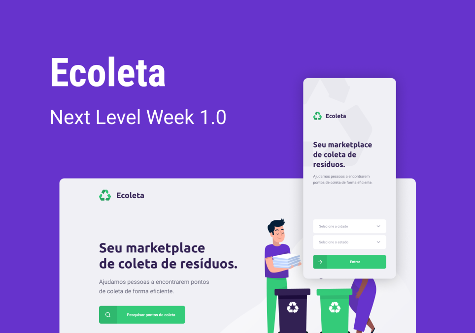
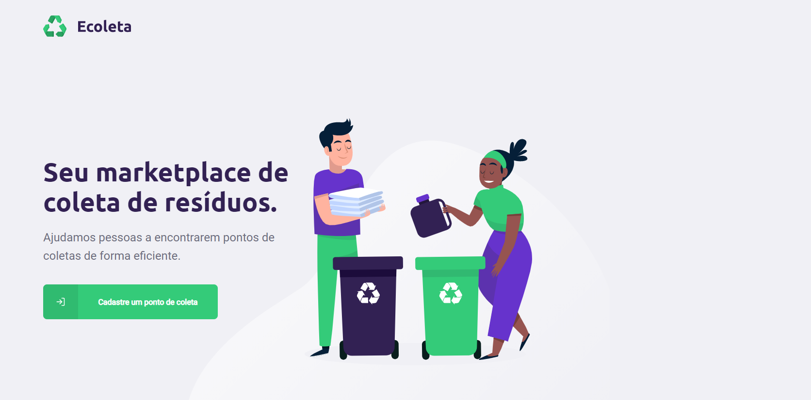
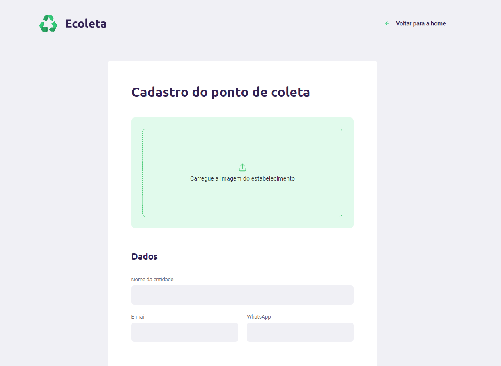
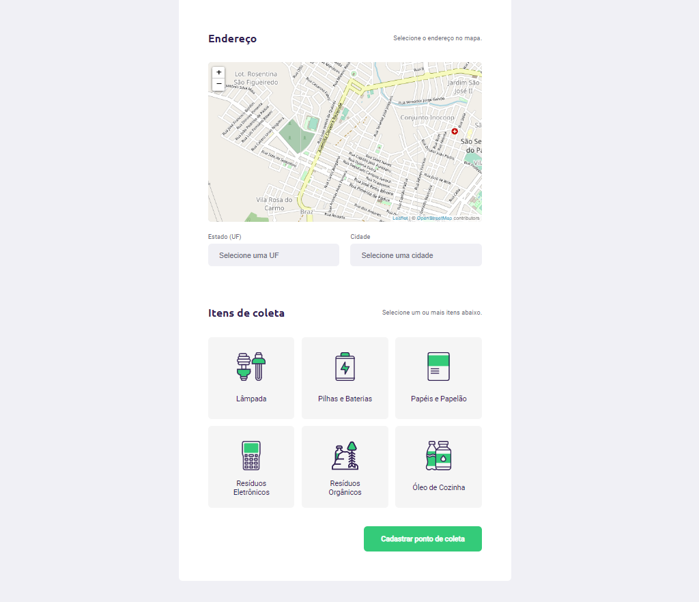
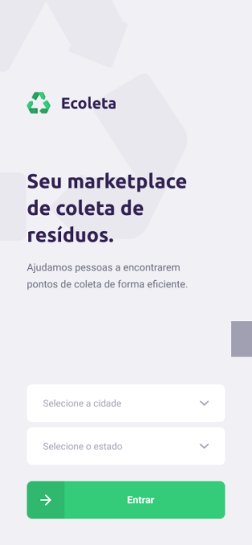
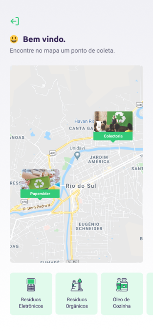
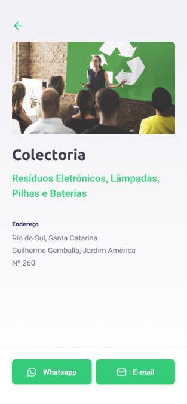

<h2 styles="text-align: center">Ecoleta - Sua Aplicação de coleta de resíduos.</h2>

    Esta é uma aplicação feita na next level week da #rocketseat, onde em uma semana nós aprendemos
    a criar uma completa aplicação (web e mobile) de um marketplace de coleta de resíduos, em comemoração
    da semana ambiental.

<h2>Tecnologias utilizadas</h2>
<ul>
    <li>NodeJS</li>
    <li>ReactJS</li>
    <li>ReactNative</li>
    <li>Expo</li>
</ul>

Essas foram as tecnologias e linguagens utilizadas

<h2>Libs e pacotes utilizados</h2>
<ul>
    <li>Knex</li>
    <li>Leaflet</li>
    <li>Axios</li>
    <li>MailComposer</li>
    <li>React Native Picker Select</li>
    <li>React Native Maps</li>
</ul>
<h2>Api's externas consumidas</h2>
<ul>
    <li>Api do IBGE para consulta de estados e cidades.</li>
</ul>
<h1>Aplicação Web</h1>

 
    A aplicação web tem a função de cadastrar um estabelecimento que 
    realiza a coleta de resíduos, utilizando do componente Leaflet foi
    utilizado um mapa free e open source onde vc seleciona no mapa a
    localização do estabelecimento junto com os itens que aquele estabelecimento
    coleta.

<h3>Tela inicial</h3>

<h3>Tela de cadastro</h3>

<h1>Aplicação Mobile</h1>

    Na aplicação mobile você seleciona a cidade e estado onde é carregado da api do IBGE
    do mesmo jeito que na aplicação web, após isso você é direcionado a tela onde
    você seleciona os itens que deseja buscar e no mapa aparecerá os estabelecimentos 
    cadastrados que coletam aquele item. Ao clicar neste estabelecimento você irá para a 
    próxima página onde tem informações sobre o estabelecimento e dois botões, para contato 
    direto por WhatsApp ou por email.

